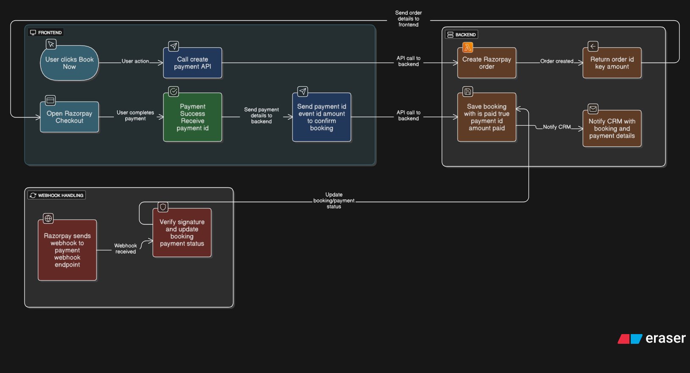

# Ahoum Booking API

This is a Flask-based backend API for a wellness booking system, built for the Ahoum Backend Developer Assignment.

## 🚀 Features

- User Registration & Login (JWT Authentication)
- View Available Events (Sessions)
- Book Events (Linked to Facilitators from CRM)
- View Upcoming & Past Bookings
- Cancel Bookings
- CRM Notification Webhook (Simulated via Logging)

---

## 📦 Tech Stack

- **Flask** & Flask-JWT-Extended
- **SQLAlchemy** ORM
- **SQLite** (default) or MySQL compatible
- `.env` based configuration
- Postman Collection for API testing

---

## 🔗 Deployed link 

- https://ahoum-booking-system.onrender.com

---

## 🧑‍💻 Setup Instructions

### 1. Clone & Install

```bash
git clone https://github.com/your-username/ahoum-backend.git
cd ahoum-backend
pip install -r requirements.txt
```

### 2. Environment Variables

Create a `.env` file in root:

```env
SECRET_KEY=super-secret
JWT_SECRET_KEY=jwt-secret
DATABASE_URI=sqlite:///ahoum.db
GOOGLE_MAPS_API_KEY = your_google_api
```

### 3. Create Tables

```bash
python run.py
# or alternatively
python seed.py  # to also add dummy facilitators & events
```

---

## 🧪 API Endpoints

| Method | Endpoint                        | Description                                           |
|--------|----------------------------------|-------------------------------------------------------|
| POST   | `/register`                      | Register a new user                                  |
| POST   | `/login`                         | Authenticate and get JWT token                       |
| GET    | `/events`                        | List all events (`?status=` and `?type=` filters)    |
| GET    | `/events/nearby`                 | Get events near a location (`lat`, `lng`, `radius`)  |
| PUT    | `/events/<event_id>`             | Reschedule or update an event                        |
| DELETE | `/events/<event_id>`             | Cancel (soft delete) an event                        |
| POST   | `/book`                          | Book an event (requires token)                       |
| GET    | `/my-bookings`                   | View past and upcoming bookings                      |
| DELETE | `/cancel-booking/<booking_id>`   | Cancel a specific booking                            |


> All protected routes require `Authorization: Bearer <token>` header.

---

## 🌍 Location Intelligence

We use the **Google Maps Geocoding API** to convert human-readable locations into precise geographic coordinates (latitude & longitude).

### 🧠 How it works:
- When creating or updating an event with a location string (e.g. `"Goa"`), the backend:
  - Calls Google Maps API
  - Retrieves `latitude` and `longitude`
  - Stores them in the database automatically

This enables:
- 📍 Nearby event search using `/events/nearby`
- 🔍 Location filtering via coordinates (`lat`, `lng`, `radius`)

> Example: Searching for events within 50 km of Delhi:


---


## 🔔 CRM Notification (Simulated)

When a booking is made, the system logs a payload like:

```json
{
  "booking_id": 1,
  "user": { "id": 1, "name": "Test User" },
  "event": { "id": 1, "title": "Mindfulness Retreat" },
  "facilitator": { "id": 1, "crm_id": "crm123" }
}
```

Located in: `app/crm.py`

---

## 📬 Postman Collection

Import the file [`Ahoum_Booking_API.postman_collection.json`](./Ahoum_Booking API.postman_collection.json) in Postman.

Set an environment variable:
```json
{ "token": "your_jwt_token_here" }
```

---

## 🗃️ Proper Database Models (Data Diagram)

All core entities (`User`, `Facilitator`, `Event`, `Booking`) are implemented using SQLAlchemy with clear relationships:

- A `User` can have many `Bookings`
- An `Event` is hosted by one `Facilitator`
- Each `Booking` links a `User` to an `Event`

The complete entity-relationship diagram (ERD) is documented in the file:

📄 [`Data Diagram.pdf`](./Data%20Diagram.pdf)

---

## 💳 Razorpay Payment Integration

📄 [View Full Razorpay Integration Plan](./docs/razorpay_plan_with_webhook.md)

🖼️ Below is the visual workflow diagram for Razorpay integration:



---

## 👤 Author

- Venkatesh Vishwas – Full Stack Developer

